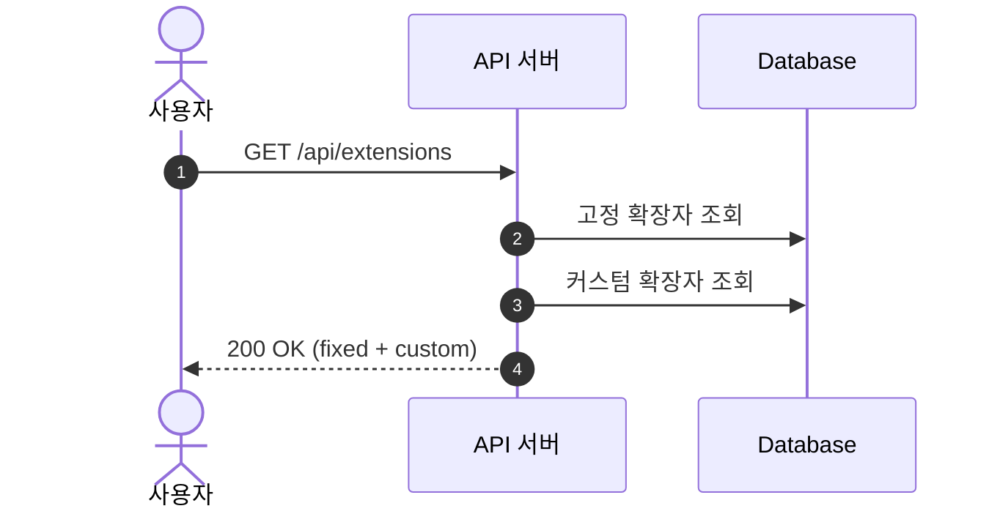
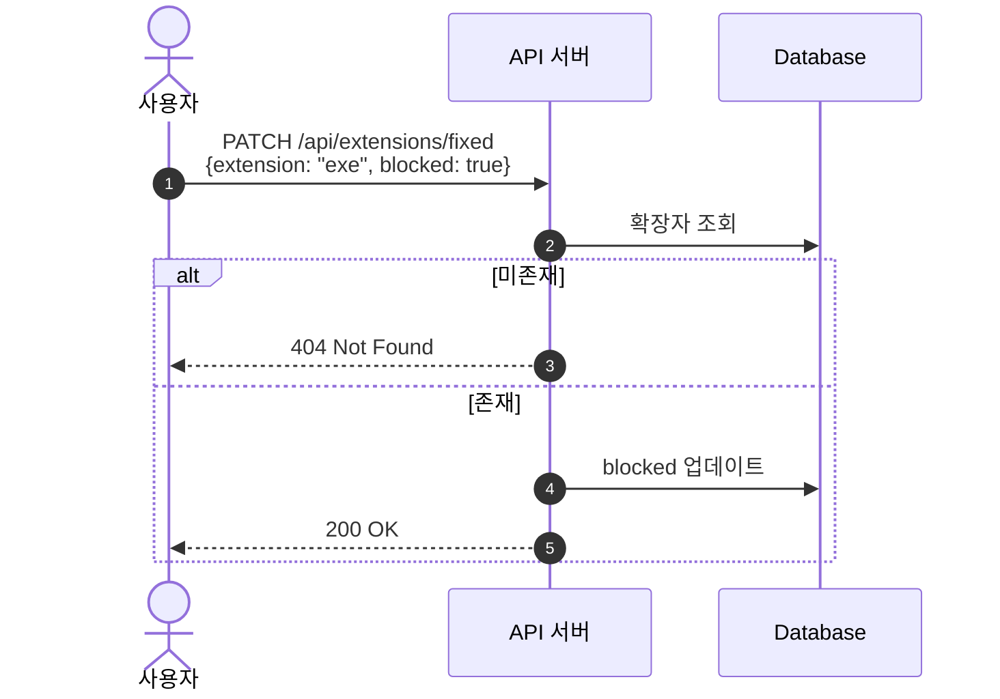
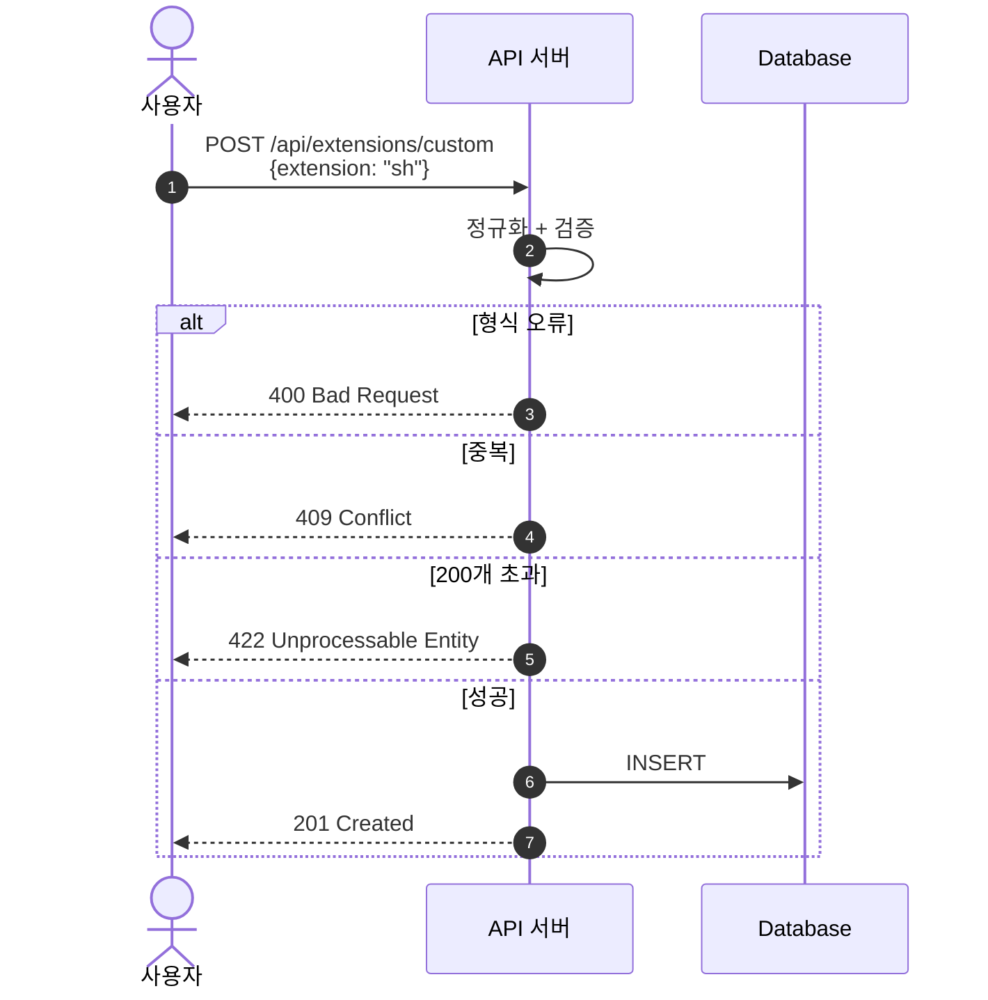
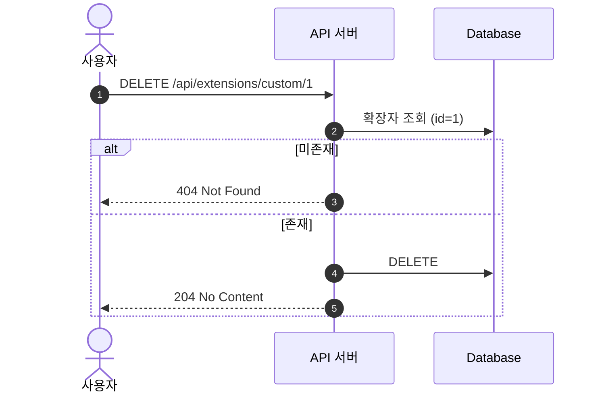
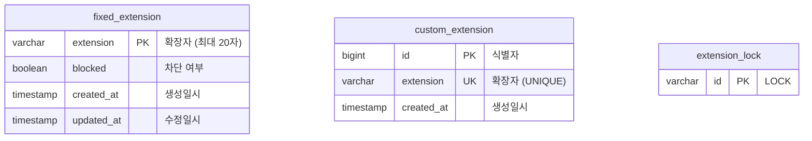

# 파일 확장자 차단 시스템 설계서

> 파일 업로드 시 보안 위험이 있는 확장자를 차단하는 관리 시스템

---

# 1. 요구사항

## 1.1 개요

파일 첨부 시 보안에 문제가 될 수 있는 확장자를 차단하는 기능입니다.
`exe`, `sh` 등의 실행파일이 서버에 업로드되어 실행될 수 있는 위험을 방지합니다.

## 1.2 용어 정의

| 용어 | 영문 | 설명 |
|------|------|------|
| 고정 확장자 | FixedExtension | 시스템 기본 제공 차단 대상 (bat, cmd 등) |
| 커스텀 확장자 | CustomExtension | 관리자가 직접 추가한 차단 대상 |
| 차단 상태 | Blocked | 해당 확장자의 파일 업로드 차단됨 |
| 정규화 | Normalize | 입력값을 표준 형식으로 변환 |

## 1.3 API 요약

| 기능 | Method | URI |
|------|--------|-----|
| 전체 목록 조회 | GET | `/api/extensions` |
| 고정 확장자 상태 변경 | PATCH | `/api/extensions/fixed` |
| 커스텀 확장자 추가 | POST | `/api/extensions/custom` |
| 커스텀 확장자 삭제 | DELETE | `/api/extensions/custom/{id}` |

## 1.4 기능 요구사항

### 고정 확장자

| 항목 | 설명 |
|------|------|
| 대상 | `bat`, `cmd`, `com`, `cpl`, `exe`, `scr`, `js` |
| 기본 상태 | 모두 미차단 (unchecked) |
| 저장 | 체크 시 DB 저장 |

### 커스텀 확장자

| 항목 | 설명 |
|------|------|
| 최대 길이 | 20자 |
| 최대 개수 | 200개 |
| 추가 | 버튼 클릭 시 DB 저장 |
| 삭제 | X 버튼 클릭 시 DB 삭제 |

### 입력값 정규화

| 입력 | 결과 | 처리 |
|------|------|------|
| `.sh` | `sh` | 점(.) 제거 |
| `SH` | `sh` | 소문자 변환 |
| ` sh ` | `sh` | 공백 제거 |

### 검증 규칙

| 항목 | 규칙 | 에러 코드 |
|------|------|----------|
| 허용 문자 | `^[a-z0-9]+$` | 400 |
| 최대 길이 | 20자 | 400 |
| 중복 체크 | 고정/커스텀 모두 | 409 |
| 최대 개수 | 200개 | 422 |

---

# 2. 시퀀스 다이어그램

## 2.1 전체 확장자 목록 조회



## 2.2 고정 확장자 상태 변경



## 2.3 커스텀 확장자 추가



## 2.4 커스텀 확장자 삭제



---

# 3. ERD



## 3.1 테이블 상세

### fixed_extension

| 컬럼 | 타입 | 제약조건 | 설명 |
|------|------|----------|------|
| extension | VARCHAR(20) | PK | 확장자명 |
| blocked | BOOLEAN | NOT NULL, DEFAULT FALSE | 차단 여부 |
| created_at | TIMESTAMP | | 생성일시 |
| updated_at | TIMESTAMP | | 수정일시 |

**초기 데이터:** bat, cmd, com, cpl, exe, scr, js (모두 blocked=false)

### custom_extension

| 컬럼 | 타입 | 제약조건 | 설명 |
|------|------|----------|------|
| id | BIGINT | PK, AUTO_INCREMENT | 식별자 |
| extension | VARCHAR(20) | UNIQUE, NOT NULL | 확장자명 |
| created_at | TIMESTAMP | | 생성일시 |
| updated_at | TIMESTAMP | | 수정일시 |

### extension_lock

| 컬럼 | 타입 | 제약조건 | 설명 |
|------|------|----------|------|
| id | VARCHAR | PK | 락 식별자 ('LOCK') |

> 동시성 제어를 위한 비관적 락 테이블

---

# 4. 프로젝트 구조

```
src/main/java/com/example/uploadextensionguard/
├── config/           # JPA Auditing, DataInitializer
├── controller/       # ExtensionController, PageController
├── service/          # ExtensionService
├── repository/       # JPA Repository
├── entity/           # FixedExtension, CustomExtension, ExtensionLock
├── dto/              # Request/Response DTO
└── exception/        # GlobalExceptionHandler, 커스텀 예외

src/main/resources/
├── templates/        # Thymeleaf (index.html)
├── static/           # CSS, JS
└── application.yml   # 환경 설정 (local/prod)
```

---

# 5. 기술 스택

| 영역 | 기술 |
|------|------|
| Backend | Java 21, Spring Boot 3.5, JPA |
| Frontend | Thymeleaf (SSR), Vanilla JS |
| Database | H2 (개발), PostgreSQL (배포) |
| API Docs | Swagger (springdoc-openapi) |
| Build | Gradle |
| Deploy | Render (Docker) |
